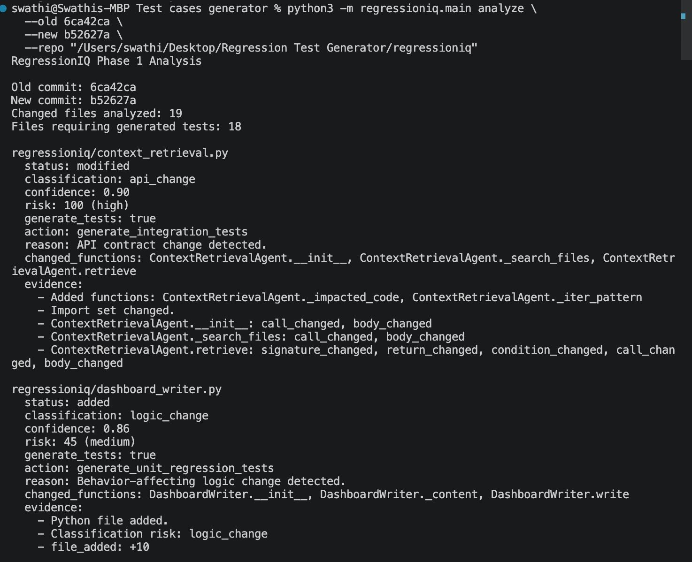

# RegressionIQ

RegressionIQ is a production-style AI engineering project for intelligent regression test planning.

The goal is to understand whether a code change actually affects behavior before asking AI to generate tests. Phase 1 compares two Git commits, performs semantic analysis on changed Python files, classifies the change, scores risk, and decides whether future regression test generation is needed.

Phase 1 does **not** generate tests, call an LLM, modify source code, or commit files.

## Why Semantic Diff?

Traditional Git diff shows what text changed, but it does not always explain whether program behavior changed. A commit may only update comments, whitespace, formatting, import order, or safe local variable names, and those changes should not trigger unnecessary regression test generation.

RegressionIQ compares code structure instead of relying only on raw diff text. It focuses on meaningful changes such as modified conditions, return values, function signatures, branch logic, validation rules, API behavior, and security-sensitive code paths. The goal is to reduce noisy test suggestions and focus attention on real behavioral risk.

## Phase 1 Scope

- Python repositories only
- pytest-oriented projects only
- local Git repositories only
- old commit vs new commit analysis
- AST-based semantic comparison
- deterministic rule-based risk scoring
- CLI and JSON reports
- local evaluation benchmark

## What It Detects

RegressionIQ currently skips or minimizes validation for:

- comment-only changes
- formatting-only changes
- import-only changes
- safe local variable renames

RegressionIQ recommends future test generation for:

- condition changes
- return value changes
- function signature changes
- branch additions or removals
- changed function calls
- added or deleted Python files
- security-sensitive logic changes

## Install

```bash
python3 -m pip install -e ".[dev]"
```

## Analyze Commits

```bash
regressioniq analyze --old OLD_COMMIT --new NEW_COMMIT
```

Analyze another local Git repository:

```bash
regressioniq analyze --old OLD_COMMIT --new NEW_COMMIT --repo /path/to/repo
```

JSON output:

```bash
regressioniq analyze --old OLD_COMMIT --new NEW_COMMIT --json
```

## Run Evaluation

```bash
regressioniq eval
```

## Example Output



Machine-readable JSON output includes the same decision evidence:

```json
{
  "path": "src/auth/tokens.py",
  "classification": "security_change",
  "confidence": 0.82,
  "risk_score": 100,
  "risk_band": "high",
  "generate_tests": true,
  "recommended_action": "generate_security_edge_case_tests"
}
```

## Architecture

```text
Git old/new commits
    -> Git file collector
    -> Python AST parser
    -> Semantic diff engine
    -> Change classifier
    -> Risk scorer
    -> Decision engine
    -> CLI/JSON report
```

## Evaluation

The evaluation dataset covers representative edge cases:

- comment-only changes
- formatting-only changes
- safe local variable renames
- return value changes
- condition changes
- API signature changes
- security-sensitive changes

Run it with:

```bash
regressioniq eval
```

Current benchmark result:

```text
Cases: 7
Classification accuracy: 100.0%
Test trigger accuracy: 100.0%
Risk band accuracy: 100.0%
Changed function accuracy: 100.0%
```

## Next Steps

Next, RegressionIQ will expand from semantic change detection into impact analysis, context retrieval, and AI-generated test suggestions. Future work will add approval workflows, automated execution, repair loops, coverage awareness, and CI integration.
